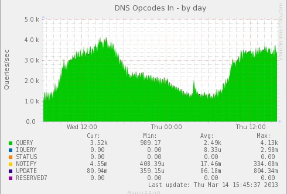
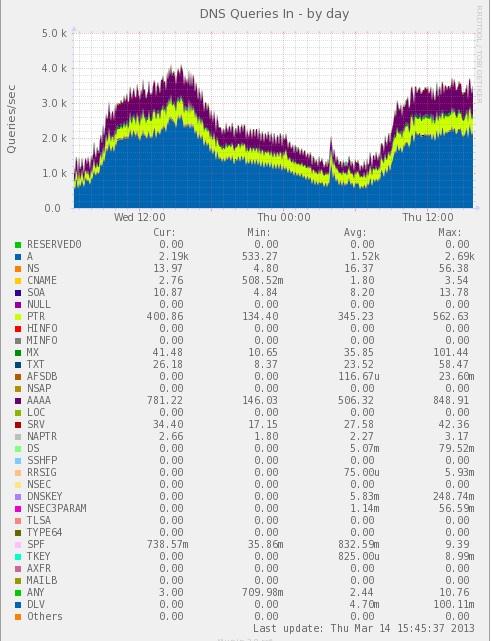
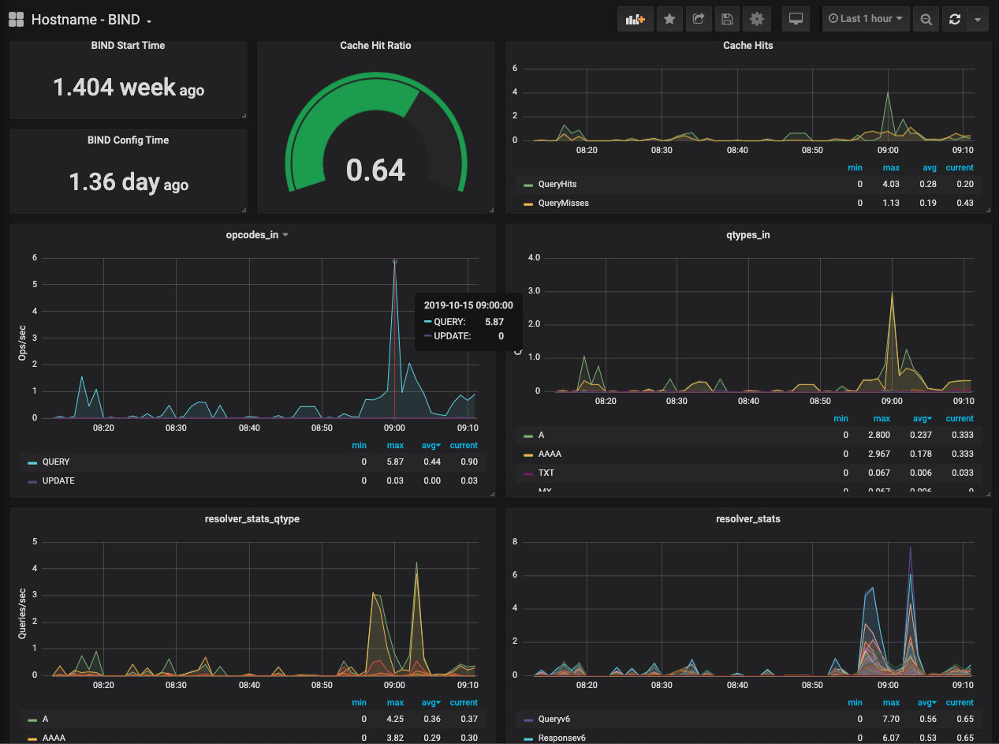
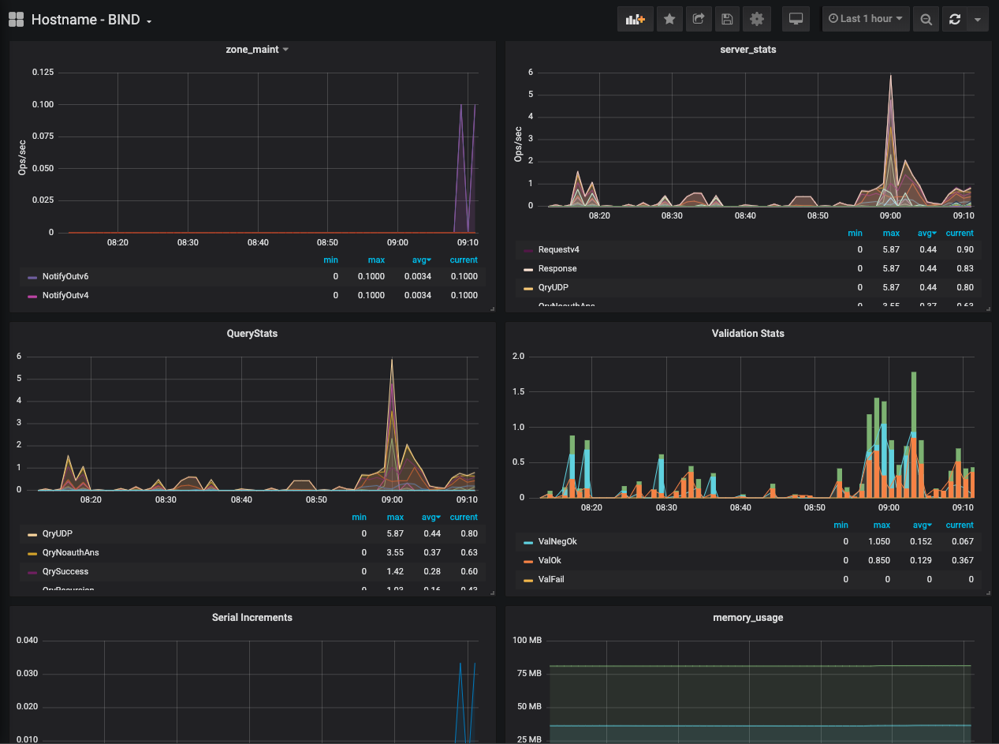
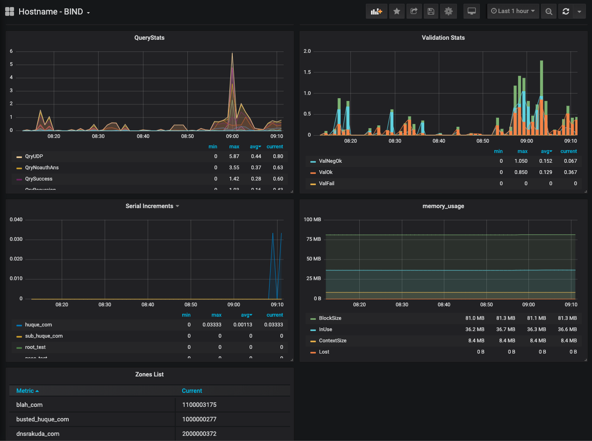

# bind9stats.py

Programs to obtain data from the statistics channel of a BIND9
DNS server, and send it to some graphing and data visualization
tools. The original program, bind9stats.py, was written to
be a plugin for Munin, and has recently been renamed to
bind9stats-munin.py. There is also a newer version, called
bind9stats-graphite.py, that works with Graphite and Grafana.

## bind9stats-munin.py: Munin plugin

version 0.31

A munin plugin to obtain data from a BIND9 statistics server, written
in Python. Tested with BIND 9.10, 9.11, and 9.12's statistics server
exporting version 3 of the statistics. In earlier versions of BIND 9.9,
the v3 schema of statistics can be specified using the 'newstats'
configuration directive. The newstats option was introduced in BIND 9.9.3.

If you are using older versions of BIND 9.9 that only support version 
2  of the XML statistics, you'll need to use the 0.1x version of this 
program, which can be obtained from: 

   https://github.com/shuque/bind9stats/archive/v0.12.tar.gz

Software needed to use this:
* Python 2.7 or later, or Python 3.x.
* BIND: BIND DNS server from isc.org. https://www.isc.org/software/bind
* Munin: a resource monitoring tool that does pretty graphs.
       See http://munin-monitoring.org/ for details.)

Some notes:
* BIND can be configured to provide per-zone query statistics also. This
  plugin currently doesn't process that data, and only does the aggregate
  statistics for the entire server.
* Only the _default view is used. Servers configured to use multiple
  views that want per view statistics will have to extend this program
  a bit.

Instructions for using this:
- Have a DNS server running BIND9, with the statistics server enabled.

  On my BIND servers, I usually have something like the following in the
  configuration file:

        statistics-channels {
                inet 127.0.0.1 port 8053 allow { 127.0.0.1; };
        };

- Have a munin-node running on it, install bind9stats.py in its plugins
  directory and restart the node.
  You can also run the plugin on another machine, if the statistics
  server allows queries remotely. Set the HOST and PORT environment
  variables appropriately in that case before invoking bind9stats.py.

Sample munin graphs produced by this plugin:

## bind9stats-graphite.py

This version of the program runs as a long lived daemon, collects
statistics at regular intervals (default is every minute), and then
sends them to a Graphite server. Graphite is commonly the default
backend for Grafana, a fancy data visualization tool/dashboard. The included sample Grafana dashboard configuration file (Grafana-BIND.json) produces output like the following:

Author: Shumon Huque

Copyright (c) 2013-2015 - Shumon Huque. All rights reserved.  
This program is free software; you can redistribute it and/or modify 
it under the same terms as Python itself.
